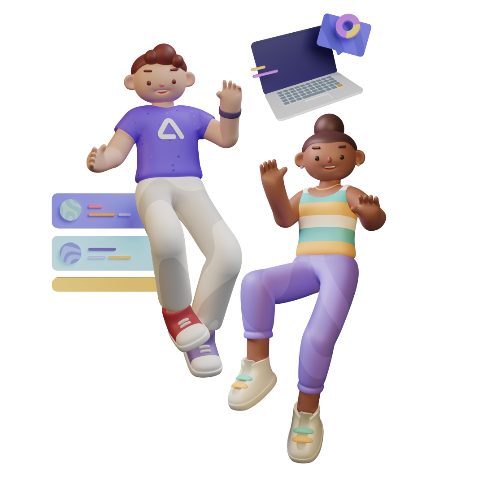

<br />
<div align= "left">
  <a href="https://github.com/JZYNX/comp30022/">
    
  </a>
  <h1 align="left"> Elevate. </h1>

  <p align="left">
    A Personal CRM System.
    <br />
    <a href="https://comp30022-crm.atlassian.net/wiki/spaces/SD/pages/884963/Team+56+Introduction"><strong>View Confluence Documentation 
    page </strong></a>
    <br />
    <a href="https://www.figma.com/file/xjiDcmLa1aQtVWc7IN3ZBL/CRM-Prototype?type=design&node-id=23-3&mode=design&t=SLFMRVLjyDp8uEs6-0">View Figma Prototype</a>
  </p>
</div>

## Meet the Team
|    Name     |        Role          |          Contact        |  What They Love  |
|    :---:    |       :---:          |           :---:         |       :---:      | 
| Jason Tang  | Full-Stack Developer | jastang02@gmail.com     | Viet Iced Coffee |
| Yifan Yang  | Full-Stack Developer | yifanyang80@gmail.com   | Valorant         |
| Linh Nguyen | Scrum Master         | linh.nguyeen3@gmail.com | Sok xD           |
| Sokphirun Tith | Product Owner/Backend Dev | stith@student.unimelb.edu.au | Maximus |
| William Xiang | Backend Developer | williamxiang007@gmail.com | TFT |

## Hosted on
https://voltaic-layout-402210.ts.r.appspot.com/

## About this project
Master of Computer Science students would like to have a convenient CRM system for sending emails, viewing their personal calendars, and building or maintaining relationships with other people in one place. This is where our development team comes in :)

## Technology Stack
MERN
-   [MongoDB](https://www.mongodb.com/) 
-   [Express(.js)](https://expressjs.com/) 
-   [React(.js)](https://reactjs.org/) 
-   [Node(.js)](https://nodejs.org/en/)

## Getting Started
This is how you can run our application locally using Node.js

### Steps 
1. Clone the repository
    ```sh
    git clone https://github.com/JZYNX/comp30022.git
    ```
2. Checkout the 'Local-demo' branch
    ```sh
    git checkout -r Local-demo
    ```
3. Run the development script in the root directory (frontend & backend)
    ```sh
    npm run start-dev
    ```
4. That is it! The server should run on Port 5000 and the client side should run on Port 3000
5. If there are any issues. Please email the Repository owner jastang02@gmail.com
6. Please use the [Login Details](#sample-login-details) provided in this ReadMe for Demo of application

## Testing Pipeline & Framework (Continuous Integration)
GitHub CI/CD pipeline through GitHub actions
Testing through [Jest](https://jestjs.io/) Framework

## Continuous Deployment
This project is continuously deployed to Google Cloud using App Engine. You can access the Google Cloud Platform [here](https://cloud.google.com/?hl=en).
Deployed using Microservices connecting the Frontend service with the Backend service.

## Sample Login Details
- username: Skyrider
- password: SokStinky69
